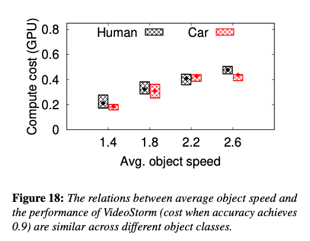

# Yoda (A Video analytic pipeline Benchmark)

## Dependency
Please set up a python virtual environment and install the packages listed in 
[requirements.txt](requirements.txt).
```bash
# set up a python3 virtualenv environment
pip install -r requirements.txt
```

## Video Download

1. Use [**youtube-dl**](https://ytdl-org.github.io/youtube-dl/index.html) to download
a video.
   1. Install youtube-dl. e.g. ```pip install youtube-dl```.
   2. Use ```youtube-dl -F <youtube URL>``` to list all formats, and choose
   a format id (e.g. 96, 137, best).
   3. If it is a live video, use the following command  
   ```ffmpeg -i $(youtube-dl -f {format_id} -g <youtube URL>) -c copy -t 00:20:00 {VDIEONAME}.ts```
   4. if not live video, run  
   ```ffmpeg -i $(youtube-dl -f {format_id} -g <youtube URL>) -c copy {VIDEONAME}.mp4```
2. Or use [**streamlink**](https://streamlink.github.io/) to download a video.
3. Use [**ffmpeg**](https://www.ffmpeg.org/) to transform and extract the
frames e.g. ```ffmpeg -i <Video Filename> %06d.jpg -hide_banner```

## Model and Label

1. The DNN models used in this project are downloaded from
[**Tensorflow Model Zoo**](https://github.com/tensorflow/models/blob/master/research/object_detection/g3doc/detection_model_zoo.md).
2. Models used in this project:
    * **Golden Model**: [faster_rcnn_resnet101_coco](http://download.tensorflow.org/models/object_detection/rfcn_resnet101_coco_2018_01_28.tar.gz)
    * [faster_rcnn_inception_v2_coco](http://download.tensorflow.org/models/object_detection/faster_rcnn_inception_v2_coco_2018_01_28.tar.gz)
    * [ssd_mobilenet_v2_coco](http://download.tensorflow.org/models/object_detection/ssd_mobilenet_v2_coco_2018_03_29.tar.gz)
3. Labels are in [**COCO**](https://tech.amikelive.com/node-718/what-object-categories-labels-are-in-coco-dataset/)
format. Labels used in this project:
    * 1 person
    * 3 car
    * 6 bus
    * 8 truck

## Data Sources and file structure

### Data Sources
* Youtube Videos
* [The KITTI Vision Benchmarking](http://www.cvlibs.net/datasets/kitti/)
* [Multiple Object Tracking Benchmark](https://motchallenge.net/)
* [Waymo Open Dataset](https://waymo.com/open/)

### File Structure
Please check [here](videos/README.md).

## Object-Level Features Covered

* Object Speed
* Object Size
* Percentage of Frames with Objects
* Object Arrival Rate
* Total Object Size

## Sample Pipelines

1. **VideoStorm** [paper](https://www.usenix.org/conference/nsdi17/technical-sessions/presentation/zhang),
[Implementation](videostorm)  
VideoStorm tunes video frame rate, frame resolution and model complexity to
save the GPU computing cost required in video analytics tasks. It uses offline 
profiling techniques to choose wise configurations. A scheduling algorithm is 
provided to coordinate jobs across multiple machine.
2. **Glimpse** [paper](http://people.csail.mit.edu/yuhan/doc/sen060-chenA.pdf),
[Implementation](glimpse)  
Glimpse client sends selected frames to Glimpse server for object detection,
and runs tracking on unselected frames in order to save GPU computing cost.
Glimpse selects frames by measuring the pixel difference across frames and
tracks objects using optical flow.
3. **NoScope** [paper](https://arxiv.org/abs/1703.02529),
[Implementation](noscope)  
NoScope uses cheap and specialized models at the client side and only send the 
undetermined frames frames to the server for golden model inference.
4. **Vigil** [paper](https://www.cs.princeton.edu/~kylej/papers/com287-zhang.pdf),
[Implementation](vigil)  
Vigil uses the outputs of a simple model on the client side to crop out useful
regions. It only encodes the useful regions to send to server for inference.
This saves the bandwidth of video transmission.
5. **AWStream** [paper](https://awstream.github.io/paper/awstream.pdf),
[Implementation](awstream)  
AWStream tunes video frame rate, frame resolution and quality parameter to save 
the bandwidth required in video transmission. It uses offline and online 
profiling techniques to choose configurations to save bandwidth and maintain 
inference accuracy.


## TODO

- [ ] Warm-up: Use the existing VideoStorm module and feature scanner module to 
generate this figure. 
    1. Run [VideoStorm](videostorm) on person-videos.
    2. Compute features on person-videos using [feature_scanner](feature_scanner).
    3. Plot feature vs\. VideoStorm performance.

- [ ] Implement VideoStorm using [Yoda interface](interface.py) in folder 
[videostorm\_interface](videostorm_interface).
    1. Input: video frames 
    2. Output: 
       - a csv file stores bounding boxes on all frames
       - a csv file stores f1 score, bandwidth, and gpu compute cost of 
       compressed video segments transmitted from client to server.
- [ ] Implement AWStream using [Yoda interface](interface.py) in folder 
[awstream\_interface](awstream_interface).
    1. Input: video frames 
    2. Output: 
       - a csv file stores bounding boxes on all frames
       - a csv file stores f1 score, bandwidth, and gpu compute cost of 
       compressed video segments transmitted from client to server.
- [ ] Implement Vigil using [Yoda interface](interface.py) in folder 
[vigil\_interface](vigil_interface).
    1. Input: video frames 
    2. Output: 
       - a csv file stores bounding boxes on all frames
       - a csv file stores f1 score, bandwidth, and gpu compute cost of 
       compressed video segments transmitted from client to server.
- [ ] Refactor feature\_scan module(used by profiler and performance\_estimator).
    - Input: video path, dataset name, video name(s), DNN model name, 
    sample rate, output filename, video segment length(seconds)
    - Output: a csv file which contains the features
- [ ] Implement [profiler](profiler) module.
    1. Input: a user-implemented pipeline, set of configurations, selected video names
    2. Output: content features vs\. primitive  performance.(file format csv)
    3. Logic: Iterate over every possible configuration and record the E2E F1 
    score, compute cost and bandwidth. Iterator over every possible configuration 
    and record each primitives's F1 score, compute cost and bandwidth. Compute 
    the feature of the videos and map the features and the performance.

- [ ] Implement [performance\_estimator](performance_estimator) module.
    1. Input: a video's scanned feature file, profiles(feature vs\. performance 
    mapping) from profiler module, a user-implemented pipeline, a configuration 
    2. Estimated performance.
- [ ] The dataset file structure should be reorganized.
<!-- - [ ] Add an elegant independence checking module. Or add this to the  -->
<!-- interface? Need to discuss. -->
<!-- - [ ] Add an elegant feature selection module? Or add this to the interface? -->
<!-- Need to discuss. -->
- [ ] Implement [training function](https://github.com/zxxia/benchmarking/blob/5154527388fe1a73f31ca8bebce19a39fb028e25/object_detection/model.py#L24) 
using TensorFlow 2.0 in object\_detection module.
- [ ] Construct the website.

- [ ] Add an example of a real profile of a pipeline.
